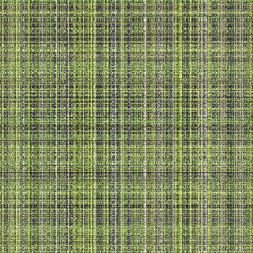

# Image Encryption for ComfyUI

A ComfyUI custom node plugin that provides **transparent pixel-level image encryption** for generated and uploaded images. It protects both the visual content of images and their embedded metadata (prompts, workflows) without disrupting the normal ComfyUI workflow.

## How It Works

The plugin operates on two levels simultaneously:

**Pixel Shuffling** — Images are encrypted by deterministically permuting rows and columns of pixels using a SHA-256-derived key via a Fisher-Yates shuffle. Decryption applies the exact inverse permutation. This transforms the image into an unrecognizable noise-like pattern.

**Metadata Encryption** — Embedded PNG metadata fields (such as `prompt` and `workflow`) are XOR-encrypted against the password and base64-encoded before saving, preventing extraction of generation parameters.

**Transparent Integration** — The plugin monkey-patches PIL's `Image.open()` and `Image.save()` methods so that encryption and decryption happen automatically. It also registers two aiohttp middlewares: one that decrypts images before serving them to the browser, and another that encrypts images immediately after they are uploaded to the `/input` folder.

Encrypted files are marked with the `Encrypt: pixel_shuffle_3` PNG metadata tag and include a SHA-256 password verification field, allowing the plugin to detect and skip already-encrypted files.

## Before & After Encryption

| Original (Decrypted) | Encrypted |
|:---:|:---:|
|  |  |
| Clear image with visible content | Pixel-shuffled noise — visually unrecognizable |